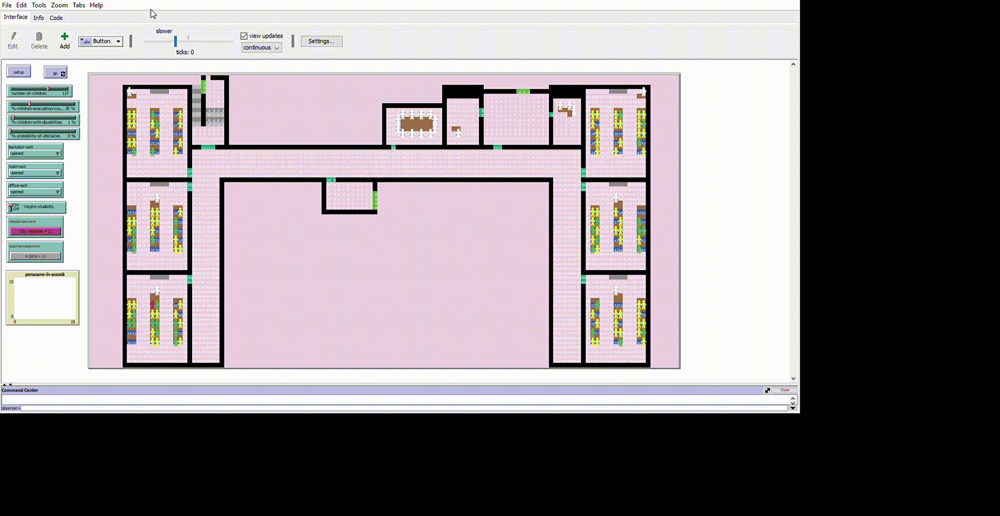

# Disaster-Evacuation-Process: Cybernetics Approach
This is the repository of the "A Cybernetics Approach to the Disaster Evacuation Process." article

# Short description of the article
In the context of an emergency, evacuating people from a location in the shortest possible time is essential, as is the high degree of safety that people should enjoy when releasing. Lately, in Romania there have been more and more fire events generated by different causes. This article will use agent-based modeling to simulate an emergency evacuation model in NetLogo. The model has been used for performing and analyzing various scenarios. Through NetLogo we made 400 simu-lations with the evacuation of 180 people (students, teachers and non-teaching staff) based on which we developed several recommendations to streamline the evacuation process in order to reduce the possibility of death. The present research will help to identify the evacuation times from a school, but it will also highlight certain aspects that may occur during the evacuation. The model that was used in this research took into account the individual particularities of the people taking part in the evacuation, emphasizing the effects that form in a crowd of people when evacuating, effects such as the funnel effect, which is caused by to the formation of bottlenecks around narrow areas. All these things are part of the analysis of the measure of entropy of the exhaust system, a problem that is in the attention of all specialists. Finally, solutions have been proposed to improve evacuation time in case of disasters.

## Simulation
> Thing to notice: The GIF below can be downloaded so you can view them at a higher resolution

